<!-- _class: title gopher-sage -->
<!-- _paginate: false -->
<!-- _header: "" -->

##### GopherCon UK · 2026

# Why Your Go Benchmarks Are Lying

And How to Stop Them

### Kemal Akkoyun · Datadog

---

<!-- _class: section -->
<!-- _paginate: false -->

###### 01

# Why Benchmark?

---

<!-- _class: vcenter -->

## Measure customer happiness,

## not CPU usage

---

## Is it actually slow?

<div class="cols">
<div class="card">

### In-process

`pprof`

Datadog Continuous Profiler

</div>
<div class="card measure">

### Whole-system

[OTel eBPF Profiler](https://github.com/open-telemetry/opentelemetry-ebpf-profiler)

[Parca](https://parca.dev)

p50 / p95 / **p99**

</div>
</div>

<br>

**Benchmark what production says is hot.**

---

## Could it go faster?

* Detecting slowness ≠ proving headroom
* The ceiling is physics: bandwidth, latency, IPC
* Headroom is the gap between now and that ceiling
* No headroom → "is it worth it" never comes up

---

## Is it worth optimizing?

* **SLO**: a target, not a wish
* **Error budget**: in budget, optimizing is optional
* **Amdahl**: only the hot path pays

---

## Latency and throughput

<div class="cols">
<div class="card">

### Latency

One operation.

*Users feel this.*

</div>
<div class="card measure hidden">

### Throughput

Operations per second.

*Your ceiling.*

</div>
</div>

---

## Latency and throughput

<div class="cols">
<div class="card">

### Latency

One operation.

*Users feel this.*

</div>
<div class="card measure">

### Throughput

Operations per second.

*Your ceiling.*

</div>
</div>

<br>

*Improve one, damage the other.*

---

## The cost of slowness

<div class="centered-table">

| Response time | Perception |
| --- | --- |
| 100-200 ms | barely noticeable |
| 300-500 ms | slightly slow |
| 1-3 s | work is noticeable |
| 5-10 s+ | user leaves |

</div>

<div class="center big">

500 ms → <span class="hl-blue">−20%</span> Google search traffic

</div>

---

<!-- _class: vcenter -->

> "Not all fast software is world-class,
> but all world-class software is fast."

Tobi Lütke · [X, 5 May 2024](https://x.com/tobi/status/1787139157078188180)

---

## Finding what to optimize

<div class="columns">
<div>

[**Optimizing Go Code Without a Blindfold**](https://www.youtube.com/watch?v=oE_vm7KeV_E)
Daniel Martí · GopherCon 2019

He covers *what* to optimize.

This talk covers *whether you can trust the number*.

</div>
<div class="center">

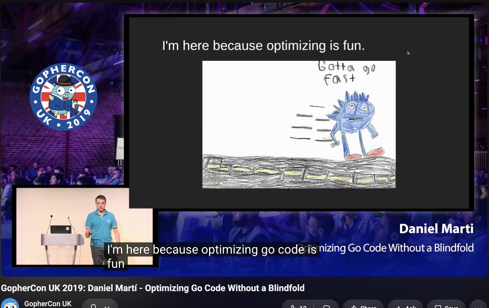

</div>
</div>

---

## Finding what is worth optimizing

<div class="columns">
<div>

[**Performance Matters**](https://www.youtube.com/watch?v=r-TLSBdHe1A)
Emery Berger · Strange Loop 2019

The component that *looks* hot
is not always the one
holding wall time.

</div>
<div class="center">

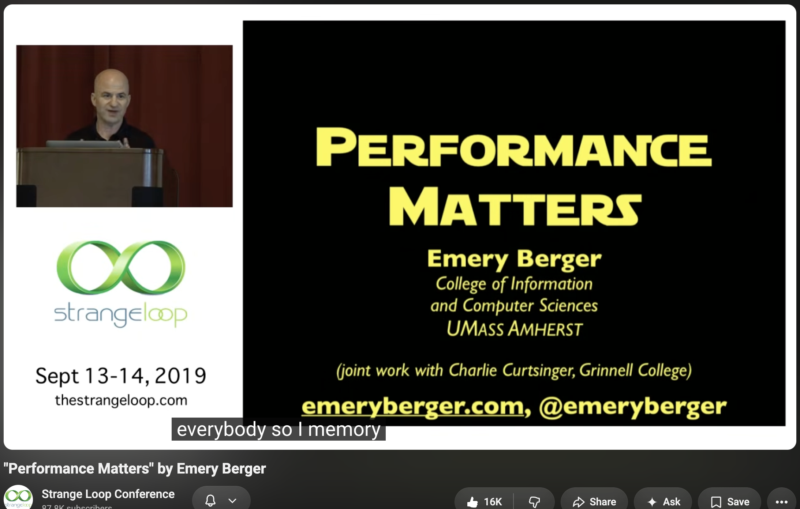

</div>
</div>

---

<!-- _class: section -->
<!-- _paginate: false -->

###### 02

# Why I Care

---

<!-- _class: vcenter -->

## How I got here

* `client_golang`: allocations in someone's scrape budget
* Parca: a 5% profiler is not deployable
* Datadog: SDKs inside *your* process

---

<!-- _class: vcenter -->

## Why Datadog cares

<div class="columns">
<div>

### Our code, your process

Every ns comes out of a
customer's budget.

</div>
<div>

### <span class="hl-blue">−3.4%</span> production CPU

from PGO alone.

</div>
</div>

<div class="center">


<span class="small">Datadog invests in performance testing internally. This talk is the spillover.</span>

</div>

### Overhead is product correctness

---

## This talk builds on

<div class="columns">
<div>

[**How to Reliably Measure Software Performance**](https://youtu.be/8211fNI_nc4)
Kemal Akkoyun & Augusto de Oliveira
FOSDEM 2026

The SMT and DFS data later in this talk
comes from this earlier version.

<span class="small">simultaneous multithreading · dynamic frequency scaling</span>

</div>
<div class="center">

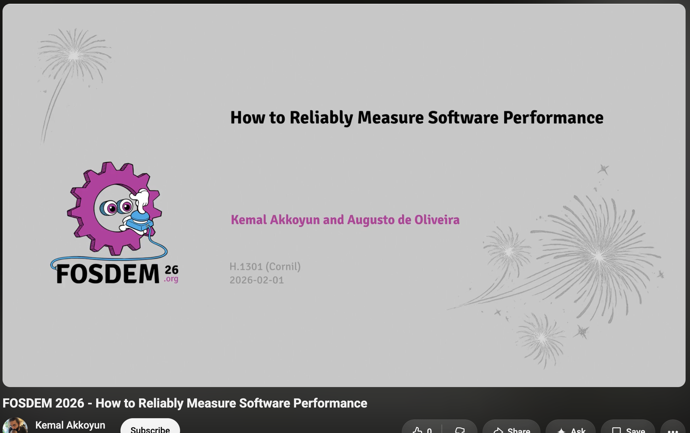

</div>
</div>

---

<!-- _class: section -->
<!-- _paginate: false -->

###### 03

# A Loose Cable

---

## September 2011

<div class="center">


</div>

---

## The cause

<div class="columns">
<div>

### A loose fibre connector

**~73 ns** early bias

A second fault pushed back
and *masked* it

<div class="small">

CERN, 22 Feb 2012 · Cartlidge,
*Science* 335(6072):1027

</div>

</div>
<div class="center">

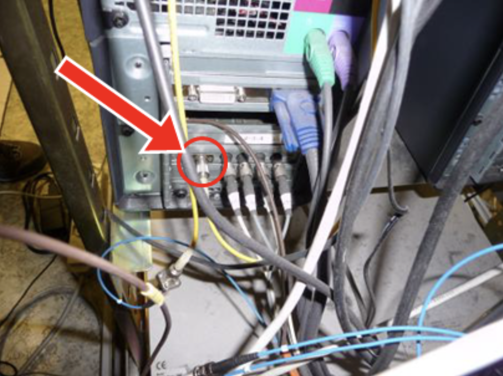

</div>
</div>

---

<!-- _class: vcenter -->

## Systematic error

## hides in plain sight

<br>

It looks like signal.

It survives expert review.

---

## Your cables

<div class="big">

compiler · scheduler · statistics

</div>

---

## Three questions

<div class="big">

1. **Real work?**
2. **Stable sample?**
3. **Above the noise?**

</div>

---

## Two scales, same three questions

<div class="centered-table">

| | First half | Second half |
| --- | --- | --- |
| **Scope** | local + micro | CI + macro |
| **Tool** | `testing.B` | whole workload |
| **Fails on** | representative | repeatable |

</div>

---

<!-- _class: section -->
<!-- _paginate: false -->

###### 04

# Before You Measure

---

<!-- _class: vcenter -->

## Every benchmark needs

## <span class="hl-blue">representative</span>

## <span class="hl-orange">repeatable</span>

---

## Micro vs macro

<div class="columns">
<div>

### Micro

Isolated function

Nanosecond precision

Risk: **not representative**

</div>
<div class="hidden">

### Macro

End-to-end workflow

Real workload

Risk: **cause is unclear**

</div>
</div>

---

## Micro vs macro

<div class="columns">
<div>

### Micro

Isolated function

Nanosecond precision

Risk: **not representative**

</div>
<div>

### Macro

End-to-end workflow

Real workload

Risk: **cause is unclear**

</div>
</div>

<br>

*Both. They fail differently.*

---

## When to use which

<div class="centered-table">

| Use case | Type |
| --- | --- |
| Comparing algorithms | Micro |
| Validating an optimization | Micro |
| Regression detection | Both |
| Capacity planning | Macro |
| User-facing latency | Macro |

</div>

---

## Start macro, then drill

<div class="columns">
<div>

### Works

1. Macro: does it move?
2. Profile: which part?
3. Micro: fix it
4. Macro: did it hold?

</div>
<div>

### Wastes weeks

1. Micro: 40% faster
2. Ship
3. Nothing changes
4. Nobody knows why

</div>
</div>

---

<!-- _class: section -->
<!-- _paginate: false -->

###### 05

# Benchmarking, Quickly

The instrument we are about to distrust.

---

## Writing one

###### bloop_bench_test.go

```go
func BenchmarkHash_BLoop(b *testing.B) {
    data := make([]byte, 1024)
    copy(data, payload)
    var s [32]byte
    for b.Loop() {
        s = sha256.Sum256(data)
    }
}
```

* Setup before the loop: excluded from timing
* `b.Loop()` runs the measured body; the result sinks somewhere visible

---

## Running one

```bash
go test -bench=. -benchmem -count=10 -benchtime=1s ./...
```

* `-bench`: what to run (`.` = all)
* `-benchmem`: show allocs (always on)
* `-count`: repetitions; `-count=1` is the default mistake
* `-benchtime`: duration, or `Nx` fixed iterations

`-count=1` is one draw from the distribution.

---

## Reading the output

###### bloop_bench_test.go

```text
BenchmarkHash_BLoop-16   6834830   356.2 ns/op   0 B/op   0 allocs/op
```

* `ns/op`: time per iteration (has a floor; can lie)
* `B/op`: bytes allocated per iteration
* `allocs/op`: allocations per iteration (cannot lie)

`ns/op` can lie. `allocs/op` cannot.

---

## Benchmark + pprof

```bash
go test -bench=BenchmarkHash_BLoop -cpuprofile=cpu.prof .
go tool pprof -top cpu.prof
```

###### pprof-top.txt

```text
      flat  flat%   sum%        cum   cum%
     2.02s 94.84% 94.84%      2.02s 94.84%  sha256.blockSHA2
     0.06s  2.82% 97.65%      0.06s  2.82%  runtime.pthread_cond_signal
     0.01s  0.47% 98.12%      2.04s 95.77%  sha256.(*Digest).Write
```

`-cpuprofile` / `-memprofile` → `go tool pprof -top`.

---

## Reading compiler output

```bash
go test -gcflags='-S' -run XXX -bench XXX .        # print assembly
GOSSAFUNC=BenchmarkHash_BLoop go test -bench=BenchmarkHash_BLoop .   # interactive SSA
```

* `-S`: disassembly; each line shows the instruction and its source
* `GOSSAFUNC`: dump every SSA rewrite phase to a browser
* Read what the compiler *actually did*, not what you wrote

`-S` shows the end state. `GOSSAFUNC` shows every step.

---

<!-- _class: section -->
<!-- _paginate: false -->

###### 06

# Local and Micro

Trust your laptop before you trust CI.

---

## The three questions, micro scale

<div class="centered-table">

| | At this scale |
| --- | --- |
| **Real work?** | the compiler deletes it |
| **Stable sample?** | one run is a point |
| **Above noise?** | your laptop is uncontrolled |

</div>

<div class="center">

*Can't trust it locally → CI industrialises the lie.*

</div>

---

## A benchmark bot comment

<div class="big center">

`BenchmarkOTLPProtoSize`

**6-9% slower than main**

</div>

<br>

<div class="center">

Nothing in the diff touches OTLP encoding.

**Hold that thought.**

</div>

---

<!-- _class: section -->
<!-- _paginate: false -->

###### 07

# Making the Compiler Honest

Question 1: real work?

---

<!-- _class: vcenter -->

## Stop the compiler

## deleting your work

<br>

<span class="chip caution">TEST-ONLY SCAFFOLDING</span>

---

## The compiler is not neutral

It sees the result is unused.

It removes the work, **correctly**.

<br>

<div class="big">

Your loop still runs `b.N` times.

It just runs empty.

</div>

---

## Dead-code elimination

###### dce_bench_test.go

```go
func makeBuffer(n int) []byte {
    return make([]byte, n) // heap-escaping allocation
}

func BenchmarkMakeBuffer_DCE(b *testing.B) {
    for range b.N {
        makeBuffer(64) // result discarded → call removed
    }
}
```

---

## `make bench-dce`

###### dce_bench_test.go

```text
DCE       0.2532 ns/op   0 B/op   0 allocs/op
correct  11.14   ns/op  64 B/op   1 allocs/op
```

<div class="center big">

`make([]byte, 64)` cannot skip allocating.

Yet: **0 allocs/op**

</div>

---

<!-- _class: vcenter -->

## `ns/op` can lie

## `allocs/op` cannot

<br>

<div class="center">

Always `-benchmem`.

</div>

---

## The two-variable sink

###### dce_bench_test.go

```go
var sink []byte // package-level: can't be proven unread

func BenchmarkMakeBuffer_Correct(b *testing.B) {
    var s []byte
    for range b.N {
        s = makeBuffer(64)
    }
    sink = s // one write per run, not per iteration
}
```

<span class="chip caution">TEST-ONLY</span> Never ship a sink to production.

---

## Escape analysis

###### gcflags-m-m.txt

```text
dce:46:13: make([]byte, 64) does not escape
dce:59:17: make([]byte, 64) escapes to heap
dce:59:17:   flow: {heap} ← s:
dce:59:17:     from sink = s (assign) at dce:61:7
```

* Discarded → `does not escape` → eliminable
* Sunk → `escapes to heap` → the allocation must happen

`-m -m` shows the flow that decides.

---

## Constant folding

###### dce_bench_test.go

```go
s = bits.OnesCount(0b10110)   // every input is constant
```

<div class="big center">

Evaluated at compile time.

You benchmarked a **constant load**.

</div>

---

## `make asm-dce`

<div class="columns">
<div>

###### dce_bench_test.go

```asm
MOVD  $3, R2
```

</div>
<div>

###### dce_bench_test.go

```asm
MOVD    onesInput(SB), R3
VCNT    V0.B8, V0.B8
VUADDLV V0.B8, V0
```

</div>
</div>

<div class="center">

Route inputs through a **package-level variable**.

</div>

---

## Inlining feeds DCE

```bash
go build -gcflags='-m'   # "can inline X"
```

<div class="center big">

Non-constant input **and** captured result.

Either alone is not enough.

</div>

<span class="chip caution">TEST-ONLY</span> `//go:noinline` is a diagnostic.

---

## Inlining decisions

###### gcflags-m-m.txt

```text
dce:33:6: can inline makeBuffer with cost 3
dce:56:6: can inline BenchmarkMakeBuffer_Correct with cost 18
```

* `can inline` with a cost under the budget → body is pasted in
* over budget → `cannot inline ... exceeds budget 80`
* `//go:noinline` forces the second case: a diagnostic, not a fix

---

## Timer: one-time setup

###### bloop_bench_test.go

```go
data := make([]byte, 1024)
copy(data, payload)
b.ResetTimer()          // exclude setup
var s [32]byte
for range b.N {
    s = sha256.Sum256(data)
}
```

<div class="center">

`ResetTimer` zeroes elapsed time. It does **not** stop the timer.

</div>

---

## Timer: per-iteration setup

###### timer_bench_test.go

```go
for range b.N {
    b.StopTimer()
    input := buildFixture(fixtureSize) // not timed
    b.StartTimer()                     // restart BEFORE the work
    s = processString(input)           // only this is measured
}
```

---

## `make bench-timer`

###### timer_bench_test.go

```text
buggy    415.8 ns/op  128 B/op  1 allocs/op
correct  550.6 ns/op  144 B/op  1 allocs/op
```

<div class="center big">

The **buggy** one looks 25% faster.

</div>

<div class="center">

A benchmark measuring the wrong thing looks like good news.

</div>

---

<!-- _class: vcenter -->

## `StopTimer` with no `StartTimer`

<div class="center big">

Duration never accumulates.

`b.N` doubles. Forever.

</div>

---

## `b.Loop()` · Go 1.24

###### bloop_bench_test.go

```go
func BenchmarkHash_BLoop(b *testing.B) {
    data := make([]byte, 1024)   // setup excluded automatically
    copy(data, payload)

    var s [32]byte
    for b.Loop() {
        s = sha256.Sum256(data)
    }
}
```

<div class="small">

Proposal #61515 · Austin Clements

</div>

---

## What `b.Loop` removes

<div class="centered-table">

| | `for range b.N` | `for b.Loop()` |
| --- | --- | --- |
| ResetTimer at start | No | **Yes** |
| StopTimer at end | No | **Yes** |
| Setup re-runs on ramp-up | Yes | **No** |
| DCE prevented | No | **Yes** |

</div>

<div class="center">

Must be written literally as `b.Loop()`.

</div>

---

## How the keepalive works

<span class="small">cmd/compile/internal/bloop</span>

* Call arguments, results, and assigned variables are kept alive inside the loop
* **Go 1.24 and 1.25** did that by *suppressing inlining* in the loop body
* Cost: benchmarks could heap-allocate where production code would not
* **Go 1.26** keeps the protection and allows inlining again

<div class="center">

The thing protecting your measurement is **also code that can be wrong**.

</div>

---

<!-- _class: section -->
<!-- _paginate: false -->

###### 08

# The Regression That Was a Speedup

---

## Read the benchmark first

###### dd-trace-go

```go
// The entire timed loop:
proto.Size(tracesData)
```

<div class="center">

Struct built **before** `ResetTimer`.

Calls **none** of the code the PR touched.

Locally: **<0.1%** run-to-run variance.

</div>

---

## Same machine, both branches

<div class="centered-table">

| Build | 1 span | 10 spans |
| --- | --- | --- |
| `main` | 883.3 ns | 7115 ns |
| `#4891` | <span class="hl-blue">840.7 ns</span> | <span class="hl-blue">6775 ns</span> |

</div>

<div class="center big">

**The PR was faster.** CI inverted the sign.

</div>

---

## The mechanism

<div class="big">

Function addresses moved.

Cache lines and branch targets moved with them.

</div>

<br>

At ~390 ns/iteration, alignment is worth several percent, **either direction**.

<div class="center">

**Resolution: no code change.**

</div>

---

## A known phenomenon

<div class="cols">
<div>

[**Performance Matters**](https://www.youtube.com/watch?v=r-TLSBdHe1A)
Emery Berger · Strange Loop 2019

<div class="big">

Code layout alone swings
performance **±10%**.

</div>

</div>
<div class="center">


</div>
</div>

---

## Causal profiling

<div class="columns">
<div>

### A flat profile says

`encode` is 30% of CPU.

</div>
<div>

### Causal profiling says

`encode` 20% faster
→ end-to-end **2%**.

</div>
</div>

<br>

<div class="center">

Virtual speedup: *what if this part got faster?*

</div>

---

<!-- _class: vcenter -->

## A component speedup

## is not a system speedup

<br>

<div class="center">

Micro measures the component.

Only macro measures whether it mattered.

</div>

---

<!-- _class: vcenter -->

## A noisy result can be

## **directionally wrong**

<br>

<div class="center">

It blocks good changes and waves regressions through.

</div>

---

<!-- _class: section -->
<!-- _paginate: false -->

###### 09

# Statistical Interpretation

Question 2: stable sample?

---

## One number is a point sample

###### noisy.txt

```text
BenchmarkMakeBuffer_Correct-16    41877204    39.39 ns/op
...
BenchmarkMakeBuffer_Correct-16    52521198    27.54 ns/op
```

<div class="center big">

Same binary. **43% swing.**

</div>

---

## `benchstat`

```bash
go test -bench=. -benchmem -count=20 . | tee new.txt
benchstat old.txt new.txt
```

<div class="centered-table">

| Environment | sec/op | Difference |
| --- | --- | --- |
| idle | `11.32n ± 5%` | n/a |
| noisy | `37.40n ± 25%` | `+230.34% (p=0.000)` |

</div>

---

## Read the output

* `11.32n`: the **median**
* `± 5%`: spread
* `p=0.000`: distinguishable from noise
* `~`: **no measurable difference.** That is a result.

---

## What `benchstat` won't tell you

<div class="checklist">
<div>✅</div><div>Is A different from B?</div>
<div>❌</div><div>Is this machine trustworthy?</div>
</div>

<br>

$$ CV = \frac{\sigma}{\mu} $$

<div class="center">

Benchstat compares distributions. **CV characterises the machine.**

</div>

---

## Rules of thumb

<div class="centered-table">

| Question | Answer |
| --- | --- |
| How many runs? | `-count=10` floor, 20 better |
| Most reproducible? | `-benchtime=100x` |
| CV too high? | **>5%: fix the machine first** |
| Significant but tiny? | Different question |

</div>

---

<!-- _class: vcenter -->

## The p-hacking trap

<div class="center big">

Every rerun is a fresh draw.

With enough draws, noise looks like signal.

</div>

<br>

<div class="center">

**Set your run count before you look.**

</div>

---

<!-- _class: section -->
<!-- _paginate: false -->

###### 10

# Local Reproduction

Question 3: above the noise?

---

## What does isolation actually buy?

<div class="centered-table">

| Condition | mean ns/op | **CV%** |
| --- | --- | --- |
| idle host | 11.46 | **4.75** |
| + 16 spinners | 34.97 | <span class="hl-blue">**18.88**</span> |
| pinned container, same load | 16.28 | <span class="hl-orange">**5.25**</span> |

</div>

<div class="small center">

Apple M4 Max · darwin/**arm64** · container linux/**arm64** under
Apple Virtualization.framework · no QEMU, no emulation

</div>

---

<!-- _class: vcenter -->

## 5.25% is not a triumph

## It is a ceiling

<br>

<div class="center big">

Bare-metal Linux, SMT off: **~0.05%**

</div>

---

## The macOS caveat

* `--cpuset-cpus=0` pins a **vCPU inside a VM**
* The VM can still migrate it across physical cores
* Nothing inside can disable host SMT or pin the clock

<br>

<div class="center">

**Get:** isolation from neighbours. **Don't get:** controlled hardware.

</div>

---

## The Linux toolbox

<div class="centered-table">

| Control | Command |
| --- | --- |
| Affinity | `taskset -c 0` |
| Core isolation | `isolcpus`, `cset shield` |
| Priority | `nice -n -5`, `chrt -f` |
| Frequency lock | `perflock` |

</div>

---

## "Is there a Go tool for this?"

```bash
perflock go test -bench=. -count=10 ./...
```

* Serialises runs so two never overlap
* Writes `scaling_min_freq` / `scaling_max_freq`

<div class="center">

**macOS:** the lock works. Frequency pinning does not.
Default `-governor 90` errors. Pass `-governor=none`.

</div>

---

## The inner loop

```bash
benchdiff --base-ref=main ./...
```

<div class="center big">

change → `benchdiff` → read the interval → decide

</div>

<div class="center">

Free wins: close the indexer, airplane mode, reach thermal steady state.

</div>

---

## Local and micro, answered

<div class="centered-table">

| | Micro scale |
| --- | --- |
| **Real work?** | sink · `-benchmem` · `allocs/op` · `b.Loop` |
| **Stable sample?** | `-count=10` · p-value · CV |
| **Above noise?** | pin it · know your ceiling |

</div>

<div class="center big">

A sub-10% delta can be **layout noise**.

</div>

---

<!-- _class: section -->
<!-- _paginate: false -->

###### 11

# CI and Macro

Same questions. Different failures.

---

## The three questions, macro scale

<div class="centered-table">

| | At this scale |
| --- | --- |
| **Real work?** | is the *workload* representative? |
| **Stable sample?** | across days, not runs |
| **Above noise?** | the *hardware* is the variable |

</div>

---

## A second bot comment

<div class="centered-table">

| Scenario | Overhead | Ceiling |
| --- | --- | --- |
| `multi` | <span class="hl-blue">**230%**</span> | 150% |
| `largeidle` | <span class="hl-blue">**212%**</span> | 150% |

</div>

<div class="center">

The fix looks like a serious regression.

</div>

---

<!-- _class: vcenter -->

## `largeidle` shares

## **zero** changed dependencies

<br>

<div class="center big">

It cannot have regressed.

The common factor was the **machine**.

</div>

---

## The mirror image

<div class="columns">
<div>

### `#4891`

CI said slower.

The laptop was right.

Cause: **code layout**.

</div>
<div>

### `#643`

The laptop said slower.

CI was right.

Cause: **machine load**.

</div>
</div>

<div class="center big">

Neither environment is authoritative by default.

</div>

<div class="center">

Same tell: **a benchmark moved that could not have moved.**

</div>

---

<!-- _class: section -->
<!-- _paginate: false -->

###### 12

# Designing a Macrobenchmark

Representative is the hard part.

---

## What does your app actually do?

* **CPU-bound**: crunching, compression, encryption
* **I/O-bound**: queries, API calls, files
* **Mixed**: almost everything real

<div class="center">

*Match your production workload.*

</div>

---

## Workload archetypes

<div class="centered-table">

| Archetype | Pattern | Shape |
| --- | --- | --- |
| **Idle** | background workers | low RPS, low CPU |
| **Latency** | microservices, APIs | high RPS, low CPU/req |
| **Throughput** | queues, batch | high CPU, many clients |
| **Enterprise** | business apps + DB | mixed CPU / I/O |

</div>

---

## Why `largeidle` falsified `multi`

<div class="columns">
<div>

### `largeidle`

**Idle** archetype

</div>
<div>

### `multi`

**Enterprise** archetype

</div>
</div>

<br>

<div class="center big">

Different code. Same movement. Same moment.

**Shared environment, not shared cause.**

</div>

---

## A macro gate is a budget

```text
scenario: multi
baseline: uninstrumented process
ceiling:  150% overhead
result:   230%   → FAIL
```

<div class="center">

Micro gates compare commits. Macro gates compare against a **budget**.

</div>

---

## What a macro gate needs at scale

* Dedicated hardware, not shared runners
* A budget per component
* Several archetypes, not one workload
* Gate the release, not only the PR

<div class="center">

Code inside someone else's process → overhead is a **customer-visible defect**.

</div>

---

## Two macro traps

<div class="columns">
<div>

### Coordinated omission

The system falls behind.

The generator stops issuing.

**p99 improves because you
measured less.**

</div>
<div>

### Non-deterministic input

Random fixtures. Live deps.

**The input moved too, so
you can't attribute a delta.**

</div>
</div>

---

<!-- _class: section -->
<!-- _paginate: false -->

###### 13

# Controlling the CI Environment

Question 3, at hardware scale.

---

<!-- _class: vcenter -->

## Why shared runners lie

<div class="center big">

A real 10% regression **vanishes**.

A phantom 10% regression **appears**.

</div>

<br>

<div class="center">

An **environment** problem, not a statistics problem.

</div>

---

## What SMT actually is

<span class="small">Simultaneous multithreading</span>

<div class="columns">
<div>

### The bet

Two threads share one core.

Most code stalls on memory,
so fill the idle slots.

Good for throughput.

</div>
<div>

### The cost

Two CPU-bound threads
**fight for the same units**.

Your runtime depends on an
invisible co-tenant.

</div>
</div>

---

## Why SMT breaks benchmarks

* A core has fixed execution units: ALUs, FPUs, load/store
* Two threads share them: neither gets the full core
* The split is **nondeterministic**: whoever has instructions ready wins the slot
* Run-to-run, your thread gets a different fraction of the units
* That fraction swings the runtime: hence the 23% CV

<div class="center">

Same code. Same core. Different **share** each run.

</div>

---

## What's the impact of disabling SMT?

<div class="center">

bare metal, DFS disabled
**2 CPU-bound tasks, <span class="hl-blue">same core</span> vs <span class="hl-orange">separate cores</span>**

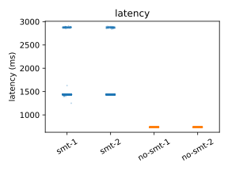

</div>

---

## What's the impact of disabling SMT?

<div class="columns">
<div>


</div>
<div>

| Task | mean ± stddev | CV |
| --- | --- | --- |
| smt-1 | 1537.64 ± 367.29 | <span class="hl-blue">23.887%</span> |
| smt-2 | 1536.88 ± 366.84 | <span class="hl-blue">23.869%</span> |
| no-smt-1 | 737.37 ± 0.32 | <span class="hl-orange">0.044%</span> |
| no-smt-2 | 737.93 ± 1.74 | <span class="hl-orange">0.235%</span> |

</div>
</div>

<div class="center big">

**~100× less variance**, and twice as fast.

</div>

---

## What DFS is

<span class="small">Dynamic frequency scaling</span>

<div class="columns">
<div>

### Governors

The kernel picks a clock:
`powersave`, `performance`,
`schedutil`.

</div>
<div>

### Why it ruins runs

Run 1 boosts.
Run 20 is warm and throttles.

Same code, different clock.

</div>
</div>

---

## Why DFS breaks benchmarks

* The clock is not fixed: a governor picks frequency from load and thermals
* Turbo boosts above base when the chip is cool
* Run 1: cool chip, high clock, fast result
* Run 20: warm chip, throttled clock, slower result
* Same cycles, different wall time: the benchmark is **not comparable**

<div class="center">

Pin to base frequency → every run at the same clock.

</div>

---

## What's the impact of disabling DFS?

<div class="columns">
<div>


</div>
<div>

| Configuration | mean ± stddev | CV |
| --- | --- | --- |
| DFS on | 533.97 ± 2.046 | <span class="hl-blue">0.383%</span> |
| DFS off | 738.18 ± 0.306 | <span class="hl-orange">0.041%</span> |

</div>
</div>

<div class="center big">

**~10× less variance**, and the mean got *slower*.

</div>

---

## Three sysfs writes

```bash
echo off         | sudo tee /sys/devices/system/cpu/smt/control
echo performance | sudo tee /sys/.../scaling_governor
echo 0           | sudo tee /sys/devices/system/cpu/cpufreq/boost
```

<div class="columns">
<div>

### Bare metal

CV ~23% → **~0.05%**

</div>
<div>

### In a VM

The write may **succeed
and be ignored**.

</div>
</div>

---

## Noise goes all the way down

<div class="center">

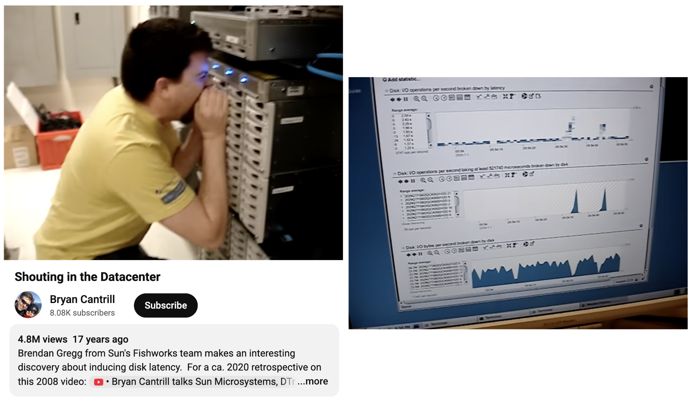

**Don't shout in the datacenter.** · [Brendan Gregg](https://www.youtube.com/watch?v=tDacjrSCeq4)

</div>

---

<!-- _class: section -->
<!-- _paginate: false -->

###### 14

# Detecting Change Over Time

Question 2, across days.

---

<!-- _class: vcenter -->

## A/B is the wrong model for CI

<div class="center big">

Benchstat compares **two** distributions.

CI has a **time series**.

</div>

<br>

<div class="center">

Comparing to the parent commit misses slow drift entirely.

</div>

---

## What regressions look like

<div class="columns">
<div>

### In a slide deck

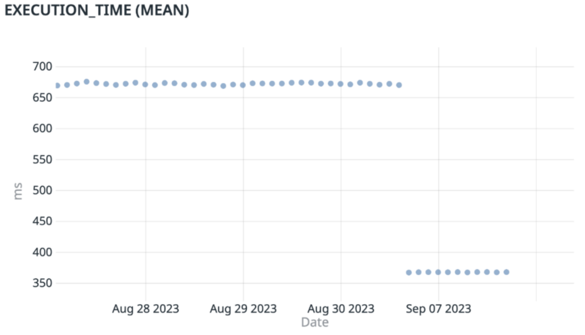

</div>
<div>

### In real data

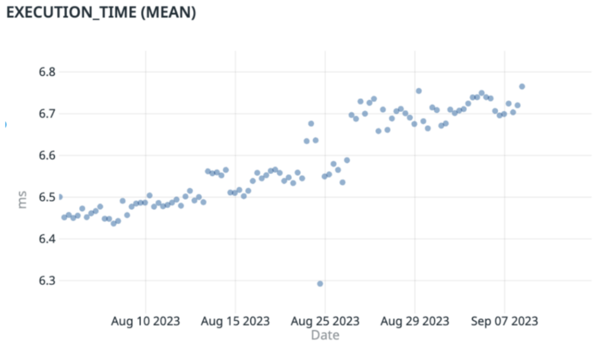

</div>
</div>

---

## Change-point detection

<div class="big center">

Not *"slower than its parent?"*

But *"where did it shift and stay shifted?"*

</div>

<div class="columns">
<div>

### Properties

* Non-normal data
* Multiple change points
* Ignores one-off spikes

</div>
<div>

### Implementations

**ED-PELT** · Akinshin

**e-divisive** · Apache Otava, Nyrkiö

Netflix, at scale

</div>
</div>

---

## Go runs this on Go

<div class="center">

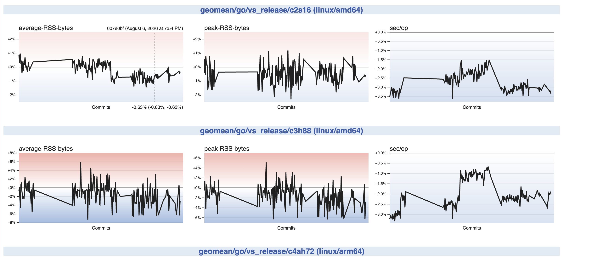

</div>

<div class="small center">

[perf.golang.org/dashboard](https://perf.golang.org/dashboard/) · every commit · per builder shape · 95% confidence interval

</div>

---

## Why a baseline, not a pair

<div class="small">

> We never report performance numbers in isolation, and only relative to some
> baseline. […] The state of a machine or VM on one day is likely to be very
> different than the state of a machine or VM on the next day.

</div>

<div class="center">

That is the Go team, about **their own hardware**.

[go.dev/wiki/PerformanceMonitoring](https://go.dev/wiki/PerformanceMonitoring)

</div>

---

<!-- _class: section -->
<!-- _paginate: false -->

###### 15

# Wiring It Into CI

---

## Two patterns

<div class="columns">
<div>

### PR gate

Fast. Strict. Every PR.

Benchmarks that regressed before.

`-count=6`, same-machine A/B

</div>
<div>

### Nightly

Complete. Pinned runner.

All controls applied.

`-count=20`, change-point detection

</div>
</div>

<div class="center">

CI **detects**. It is not your primary measurement.

</div>

---

## The feedback loop

<div class="center">

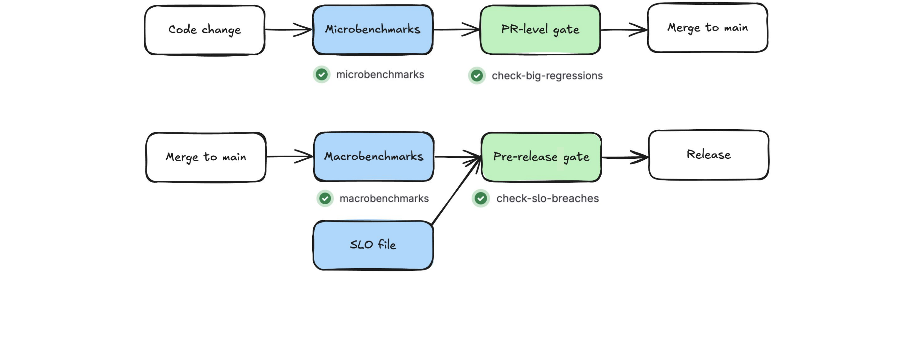

</div>

---

## Upstream splits it the same way

<div class="cols">
<div class="card">

### Presubmit

`perf_vs_parent`
`perf_vs_tip`

Opt-in per change, via a SlowBot.

</div>
<div class="card measure">

### Postsubmit

`perf_vs_release`

Every commit. The baseline shifts
on every minor release.

</div>
</div>

---

## Why not just add more runners?

<div class="center">

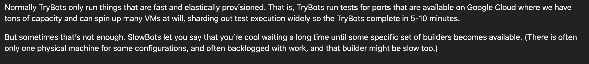

</div>

<div class="center">

Elastic capacity is fine for correctness.
Performance needs the **scarce** machine.

<span class="small">[go.dev/wiki/SlowBots](https://go.dev/wiki/SlowBots)</span>

</div>

---

## Existing tools

<div class="centered-table">

| Tool | Fit |
| --- | --- |
| [**bencher.dev**](https://bencher.dev) | Hosted, Go-native, PR comments |
| [**github-action-benchmark**](https://github.com/benchmark-action/github-action-benchmark) | Simple first gate, threshold only |
| [**Apache Otava**](https://otava.apache.org) | Change-point detection |
| [**gobenchdata**](https://github.com/bobheadxi/gobenchdata) | GitHub Pages dashboards |
| [**CodSpeed**](https://codspeed.io/docs/benchmarks/go) | Hosted; Go is walltime-only |
| [**prombench**](https://github.com/prometheus/test-infra) | Macro E2E on dedicated nodes |

</div>

---

## Keep a ledger of false positives

<div class="small">

> Known `BenchmarkOTLPProtoSize` false positive, documented for #4891 as a
> same-package code-layout artifact. Touches no code I changed;
> local A/B was ~+0.3%. No action.

</div>

<div class="center big">

Documented noise is **benchmark hygiene**.

</div>

---

## CI and macro, answered

<div class="centered-table">

| | Macro scale |
| --- | --- |
| **Real work?** | archetype · pinned inputs |
| **Stable sample?** | time series · change points |
| **Above noise?** | bare metal · SMT + DFS off |

</div>

<div class="center big">

A shared runner cannot be fixed with **more samples**.

</div>

---

<!-- _class: section -->
<!-- _paginate: false -->

###### 16

# Wire It Up

This afternoon.

---

## Three tools

```bash
honestbench ./...                                 # static analysis
benchgate   -pkg=./... -count=10 -cv-threshold=5  # CV gate
benchenv                                          # env diagnosis
```

```bash
go install github.com/kakkoyun/benchlab/cmd/...@latest   # all three
npx skills add kakkoyun/benchlab --all                    # agent skills
```

---

## `honestbench`

###### benchlab

```text
dce_bench_test.go:46:3: high: discarded-result:
    call to makeBuffer() result is discarded;
    compiler may eliminate this call via DCE

timer_bench_test.go:80:3: high: stoptimer-without-starttimer:
    b.StartTimer() called after the work under test

17 findings (2 high, 4 medium, 11 info) across 12 functions
```

<div class="center">

AST analysis. **Nothing has to run.**

</div>

---

## `benchgate`

###### benchlab

```text
# threshold 5%   → FAIL
BenchmarkMakeBuffer_Correct  mean=11.8 ns/op  cv=5.2%  ✗

# threshold 8%   → PASS
BenchmarkMakeBuffer_Correct  mean=11.1 ns/op  cv=2.2%  ✓
```

<div class="center">

Catches a noisy machine **before** the number reaches a PR comment.

</div>

---

## `benchenv`

###### benchlab

```text
benchenv: environment diagnosis (darwin/arm64, 16 CPUs)

  [unavailable]  SMT control — no sysfs on macOS
  [unavailable]  CPU frequency — not exposed
  [unavailable]  Turbo Boost — no user-space control
  [ok]           load average 6.15 ≤ 8.0
  [warn]         perflock not installed
  [ok]           benchstat installed

Summary: 3 ok, 2 warn, 4 unavailable.
```

---

<!-- _class: punchline dark -->
<!-- _paginate: false -->

# Four *unavailable* lines are the honest answer

---

## The minimum viable discipline

```bash
# 1. Add a sink.
# 2. Run enough samples.
go test -bench=. -benchmem -count=10 | tee new.txt
benchstat old.txt new.txt
# 3. Check the machine before you believe it.
benchenv
```

<div class="center big">

Under an hour.

</div>

---

## Three questions, two scales

<div class="centered-table">

| | Local + micro | CI + macro |
| --- | --- | --- |
| **Real work?** | sink · `-benchmem` · `b.Loop` | archetype · pinned inputs |
| **Stable sample?** | `-count=10` · benchstat · CV | time series · change points |
| **Above noise?** | pin it · know the ceiling | bare metal · SMT + DFS off |

</div>

<div class="center">

A sub-10% micro delta can be layout noise.
A shared runner cannot be fixed with more samples.

</div>

---

<!-- _class: dark -->

# Take it with you

<div class="columns">
<div>

### Benchmarks you can audit

[github.com/kakkoyun/benchlab](https://github.com/kakkoyun/benchlab)

`honestbench` · `benchgate` · `benchenv` · Agent Skills

[Talk repo, decks, captured results](https://github.com/kakkoyun/gopherconuk-26)

[Earlier FOSDEM version](https://youtu.be/8211fNI_nc4)

</div>
<div class="center">


**Scan for the talk repo**

</div>
</div>

---

<!-- _class: end gopher-rocket -->
<!-- _paginate: false -->

# Questions?

[kakkoyun.me](https://kakkoyun.me) · [github.com/kakkoyun](https://github.com/kakkoyun)

[linkedin.com/in/kakkoyun](https://www.linkedin.com/in/kakkoyun/) · [bsky.app/profile/kakkoyun.me](https://bsky.app/profile/kakkoyun.me) · [x.com/kakkoyun_me](https://x.com/kakkoyun_me)

<span class="small">Talk repo [github.com/kakkoyun/gopherconuk-26](https://github.com/kakkoyun/gopherconuk-26) · Tools [github.com/kakkoyun/benchlab](https://github.com/kakkoyun/benchlab)</span>
