<!-- _class: title gopher-network -->
<!-- _paginate: false -->
<!-- _header: "" -->

##### GopherCon UK · 2026

# Zero-Touch

### Go Instrumentation

How to Instrument Go Without Changing a Single Line of Code

### Kemal Akkoyun · Datadog

---

<!-- _paginate: false -->

## The bug you cannot reproduce locally

<br>

- Added a log line. Redeployed.
- Wrong place. Did it again.

---

<!-- _class: vcenter -->
<!-- _paginate: false -->

# What if you did not have to?

---

<!-- _class: vcenter -->

# Every new dependency creates another place to forget

<br>

You wrapped every HTTP client and database call by hand.

The first service gets careful instrumentation.

The fiftieth inherits gaps.

---

## Other runtimes have an attachment point

| Runtime | Zero-code mechanism |
| --- | --- |
| **JVM** | `-javaagent`, JVMTI, bytecode rewriting |
| **Python** | Import hooks, `sys.settrace` |
| **.NET** | CLR profiling APIs and startup hooks |
| **Go** | Native binary. No classloader. No bytecode. |

<br>

### Go made deployment simple. It made late instrumentation hard

---

## A short convergence timeline

| Date | Milestone |
| --- | --- |
| Jun 2024 | Elastic's profiler joins OpenTelemetry |
| Jan 2025 | Alibaba, Datadog, and Quesma form the Go compile-time SIG |
| 2025 | Beyla becomes OpenTelemetry eBPF Instrumentation |
| Jul 2026 | `otelc` v1 becomes stable |

The projects did not collapse into one agent. They learned to compose.

---

<!-- _class: vcenter -->

## How I got here

* `client_golang`: I wrapped handlers by hand, for years
* Parca: a profiler nobody has to install
* `otelc`: instrumentation that ships inside *your* binary

<br>

### Each job taught the same thing: hand-written instrumentation decays

<span class="small">Prometheus Steering Committee · maintainer of `client_golang` and OpenTelemetry Go compile-time instrumentation</span>

---

<!-- _class: vcenter -->

## Why Datadog cares

<div class="columns3">
<div class="center">

### Build time

Orchestrion

OpenTelemetry `otelc`

</div>
<div class="center">

### Process start

Language agents

Single-Step Instrumentation

</div>
<div class="center">

### Runtime + kernel

eBPF instrumentation

Continuous profiling

</div>
</div>

<br>

We build Go instrumentation at all three layers. Each layer solves a different constraint.

---

<!-- _paginate: false -->
<!-- _header: "" -->

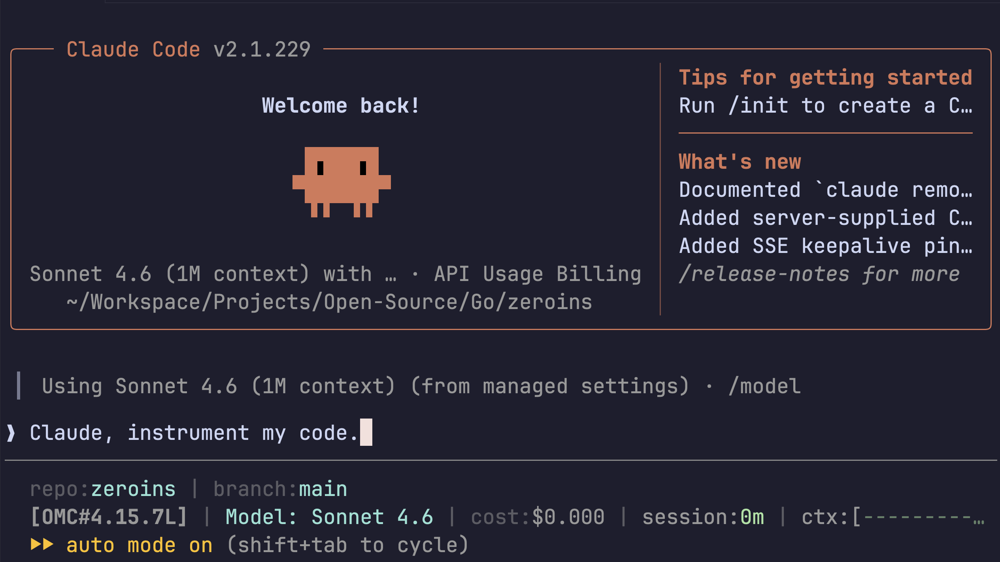

---

<!-- _paginate: false -->
<!-- _header: "" -->

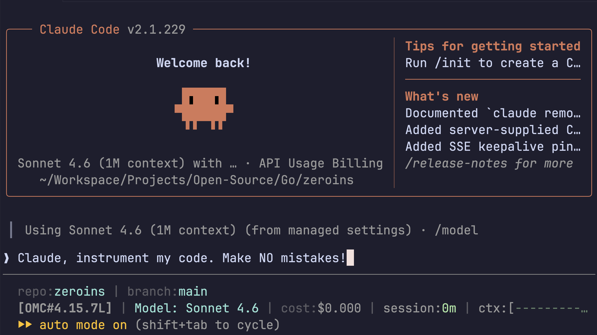

---

<!-- _class: section -->
<!-- _paginate: false -->

###### 01

# Why Go resists instrumentation

---

## What makes Go different

* The compiler emits native machine code.
* The internal linker produces static binaries by default.
* There is no classloader or general runtime hook API.
* Goroutines move between OS threads and use movable stacks.

<br>

There is no single point where an agent can safely rewrite every function at startup.

---

## What Go actually has

###### runtime/proc.go

```go
// gopark should be an internal detail,
// but widely used packages access it using linkname.
// Notable members of the hall of shame include:
// ...
```

<br>

The Go team calls this access pattern a "hall of shame," not an instrumentation API.

---

## Choose where to intervene

<div class="center">

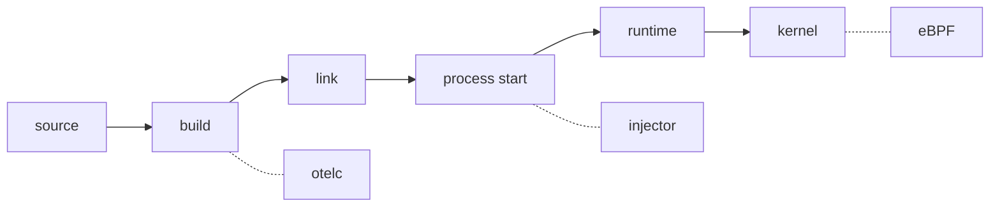

</div>

| Layer | Trade-off |
| --- | --- |
| **Build** | Rebuild required; rich Go semantics; portable binary |
| **Process start** | No source change; binary/linking restrictions |
| **Kernel** | No rebuild; Linux, privileges, and kernel contracts |

---

## Runtime injection is a narrower route

* Dynatrace OneAgent supports eligible dynamically linked Go binaries.
* The OpenTelemetry host injector ships Java, .NET, Node.js, and Python agents. It does not inject Go.
* The OpenTelemetry Operator has a separate, feature-gated Go eBPF sidecar.
* Datadog is working on a Go path for Single-Step Instrumentation.

<br>

Runtime injection is useful, but Go's default static binary leaves less surface to attach to.

---

<!-- _class: section -->
<!-- _paginate: false -->

###### 02

# OBI: observe from the kernel

---

## OpenTelemetry eBPF Instrumentation

**OBI** is the upstream successor to Grafana Beyla, donated to OpenTelemetry in 2025.

* No application rebuild.
* One DaemonSet can observe a mixed-language node.
* Network protocols provide broad coverage.
* Go-specific uprobes add library-level detail.

<br>

<span class="chip caution">v0: breaking changes are still possible</span>

---

## How OBI works

<div class="center">

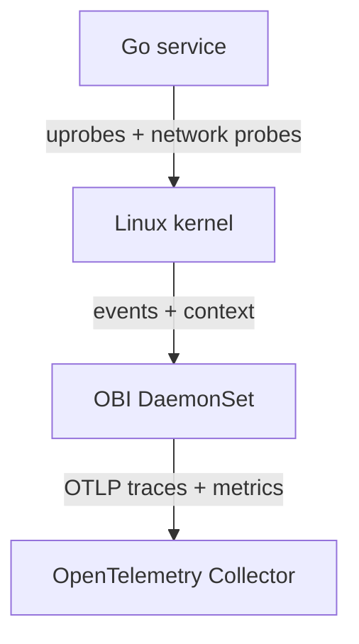

</div>

---

<!-- _class: punchline dark -->
<!-- _paginate: false -->

# No source change

# No rebuild

# No application rollout

---

## Go library coverage: 13 documented baselines

<div class="columns">
<div>

- `net/http`
- `golang.org/x/net/http2`
- `gorilla/mux`
- `gin-gonic/gin`
- `google.golang.org/grpc`
- `net/rpc/jsonrpc`
- `database/sql`

</div>
<div>

- `go-sql-driver/mysql`
- `lib/pq`
- `redis/go-redis/v9`
- `segmentio/kafka-go`
- `IBM/sarama`
- `mongo-driver` v1 and v2

</div>
</div>

<div class="tiny">

`gin >= v1.6.0, != v1.7.5` · `redis/go-redis/v9 >= v9.0.0` · [OBI support matrix](https://github.com/open-telemetry/opentelemetry-ebpf-instrumentation/blob/main/SUPPORT_MATRIX.md)

</div>

---

## What OBI emits

<div class="columns">
<div>

### Native signals

**Traces**
HTTP, gRPC, database, messaging

**Metrics**
RED and runtime metrics

</div>
<div>

### Log correlation

OBI can enrich selected **JSON logs** with `trace_id` and `span_id` while a span is active.

It leaves log shipping to your existing pipeline. It is not a log exporter.

</div>
</div>

<div class="tiny">

[OpenTelemetry: OBI trace-log correlation](https://opentelemetry.io/docs/zero-code/obi/trace-log-correlation/)

</div>

---

## The platform contract

| Requirement | OBI |
| --- | --- |
| Operating system | Linux only |
| Architecture | `amd64`, `arm64` |
| Kernel | 5.8+, or documented RHEL 4.18+ backports |
| Kernel metadata | BTF |
| Deployment | Host process, sidecar, or DaemonSet |
| macOS / Windows | Linux VM or remote cluster |

---

## Privileges depend on the mode

| Mode | Additional access |
| --- | --- |
| Network flow capture | `CAP_BPF`, `CAP_NET_RAW` |
| Application observability | Process/ELF access, `CAP_PERFMON`, uprobes |
| Context propagation | `CAP_NET_ADMIN` |
| Go library propagation | May require `CAP_SYS_ADMIN` |

<br>

`kernel.perf_event_paranoid`, Secure Boot, and kernel lockdown can change what works.

---

## What actually works without source changes

<div class="columns">
<div>

### OBI handles

- Service boundaries
- HTTP and gRPC spans
- RED and runtime metrics
- Supported library operations
- JSON log correlation

</div>
<div>

### Application code still owns

- Business events
- Domain-specific attributes
- Arbitrary internal functions
- Unsupported libraries
- Custom sampling decisions

</div>
</div>

---

<!-- _class: punchline dark -->
<!-- _paginate: false -->

# But it still has a *cost*

---

## Uprobes have real costs

<div class="columns">
<div>

### Infrastructure cost

An attached uprobe crosses into the kernel. Heavy contention once hurt scalability across many CPUs.

Kernel 6.12 includes major RCU-protected hot-path improvements.

</div>
<div>

### Program and compatibility cost

Shared BPF state can serialize a concurrent application path.

Go runtime and library layout changes can invalidate offsets. Go 1.26 required an OBI symbol-resolution fix.

</div>
</div>

<div class="tiny">

[Usama Saqib, FOSDEM 2026](https://fosdem.org/2026/schedule/event/H3LM7G-performance_and_reliability_pitfalls_of_ebpf/) · [Linux uprobe hot-path series](https://lists.openwall.net/linux-kernel/2024/08/13/142) · [OBI PR #1851](https://github.com/open-telemetry/opentelemetry-ebpf-instrumentation/pull/1851)

</div>

---

## Usama Saqib: pitfalls of production eBPF

<div class="columns">
<div class="center">

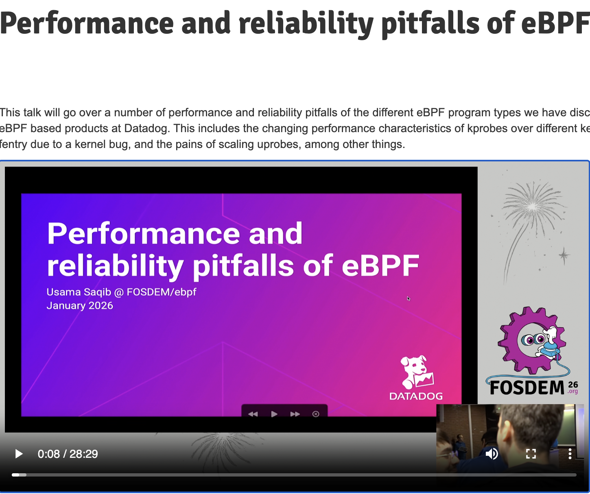

</div>
<div>

He covers the pitfalls found building production eBPF at Datadog: kprobe performance across kernel versions, a fentry kernel bug, and the pain of scaling uprobes.

Twenty-eight minutes, public, and it goes deeper than this section can.

[Performance and reliability pitfalls of eBPF, FOSDEM 2026](https://fosdem.org/2026/schedule/event/H3LM7G-performance_and_reliability_pitfalls_of_ebpf/)

</div>
</div>

---

<!-- _class: meme -->
<!-- _paginate: false -->

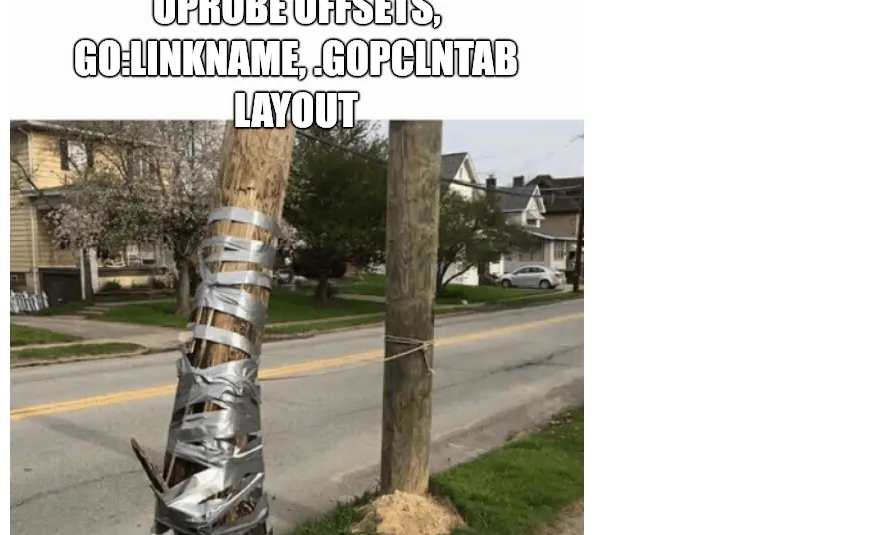

somehow, it works

---

<!-- _class: section -->
<!-- _paginate: false -->

###### 03

# otelc: instrument during the build

---

## Three organizations converged upstream

<div class="center">

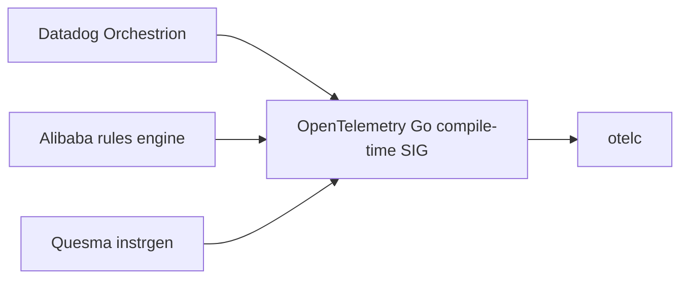

</div>

`otelc` is a vendor-neutral tool built by the SIG.

Orchestrion remains a production Datadog distribution of the same core idea.

---

## `-toolexec` puts otelc before the compiler

<div class="center">

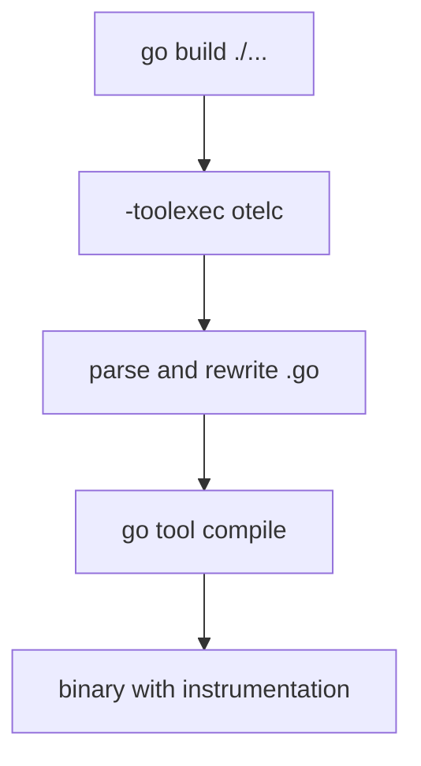

</div>

---

## Production evidence

<div class="columns">
<div class="center">

<div class="big" style="color: var(--purple);">v1</div>

Stable upstream tool

</div>
<div class="center">

<div class="big" style="color: var(--purple);">20%</div>

Growth in customers adopting Orchestrion-based auto-instrumentation

</div>
</div>

<br>

One build-command change can standardize instrumentation across a fleet.

---

## Build-time instrumentation is portable

| | otelc |
| --- | --- |
| Runtime privilege | None |
| Linux kernel dependency | None |
| Build pipeline change | `otelc go build` |
| Tested build targets | Linux, macOS, Windows |
| Go baseline | Go 1.25+ |
| Runtime cost | Injected SDK and instrumentation code |

<br>

The trade-off is build ownership, not operating-system access.

---

## Signal depth depends on the integration bundle

<div class="columns">
<div>

### Upstream otelc today

- Traces
- HTTP and gRPC metrics
- Go runtime metrics
- `slog` and Logrus records

</div>
<div>

### Orchestrion + dd-trace-go

- Traces
- Runtime metrics
- Correlated logs
- Continuous profiles

</div>
</div>

Not every Alibaba and Datadog integration has moved to otelc yet. We will have much more.

---

<!-- _class: punchline dark -->
<!-- _paginate: false -->

# And it can reach *deep*

---

## Compile time can reach Go internals! Dark Magic!

###### gls.orchestrion.yml

```yaml
join-point:
  struct-definition: runtime.g
advice:
  - add-struct-field:
      name: __dd_gls_v2
      type: any
```

<div class="small">

The aspect adds goroutine-local storage, typed accessors, and exit cleanup.

`dd-trace-go` owns this tracer-context integration. otelc supplies the rewriting engine.

</div>

---

## `go:linkname` variables are fragile

Unlike function linknames, variables have no definition/reference separation.

When both sides are uninitialized BSS symbols, the linker chooses by symbol loading order.

> "the choice is arbitrary. In the implementation it depends on the symbol loading order"
>
> Ian Lance Taylor, [golang/go#72032](https://github.com/golang/go/issues/72032)

This broke between Go 1.22 and 1.23.

---

<!-- _class: meme -->
<!-- _paginate: false -->

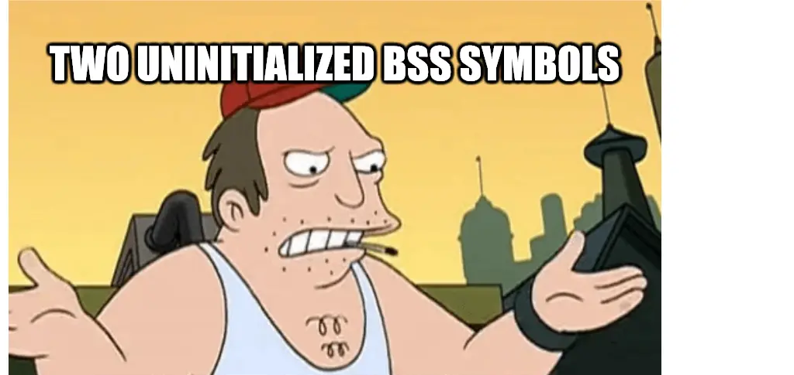

the linker picks by symbol loading order

---

## The build path has boundaries too

* Requires control of the Go build pipeline.
* Requires Go 1.25 or newer for current otelc.
* Coverage stops at the supported integration set.
* Toolchain internals such as `-toolexec` and `go:linkname` can change.

<br>

No root access and no kernel version gate, but the binary must be rebuilt.

---

<!-- _class: section -->
<!-- _paginate: false -->

###### 04

# Process start: the injector

---

## What the injector is

A shared library loaded at process start. No source change, no rebuild.

Datadog Single-Step Instrumentation and the OpenTelemetry host injector both live here. Today they ship Java, .NET, Node.js, and Python.

---

## `LD_PRELOAD` reaches only some Go binaries

```bash
LD_PRELOAD=./tracer.so ./python-app
LD_PRELOAD=./tracer.so ./go-app

go build -ldflags="-linkmode=external"
```

| Build | Result |
| --- | --- |
| Dynamically linked process | Injection can work |
| Default internally linked Go binary | No dynamic-loader hook |
| Static cgo or pure-Go PIE | No compatible library-injection path |

---

## The teaser

```bash
LD_PRELOAD=./libdd_go_hook.so \
DD_SERVICE=my-service \
DD_TRACE_DEBUG=1 \
./my-go-app
```

`DD_TRACE_DEBUG=1` shows span creation and trace-id extraction on stderr.

<span class="chip caution">in development</span>

---

<!-- _class: punchline dark -->
<!-- _paginate: false -->

## What it means

# No rebuild
# No source change
# No kernel version gate

### *One line.*

---

<!-- _class: section -->
<!-- _paginate: false -->

###### 05

# Profiles complete the four signals

---

<!-- _class: punchline dark -->
<!-- _paginate: false -->

## Traces tell you which request was slow

<br>

# Profiles tell you where the *CPU* went

---

## OpenTelemetry eBPF Profiler

Originated as Elastic Universal Profiling and joined OpenTelemetry in June 2024.

* Samples CPU from the kernel.
* Profiles every process on a node.
* Requires no application rebuild or injected library.
* Emits the OpenTelemetry Profiles signal.

<br>

<span class="chip note">Profiles: Alpha specification</span>

---

<!-- _class: punchline dark -->
<!-- _paginate: false -->

# But how does it read a *stripped* binary?

---

## Go stacks survive stripped binaries

<div class="center">

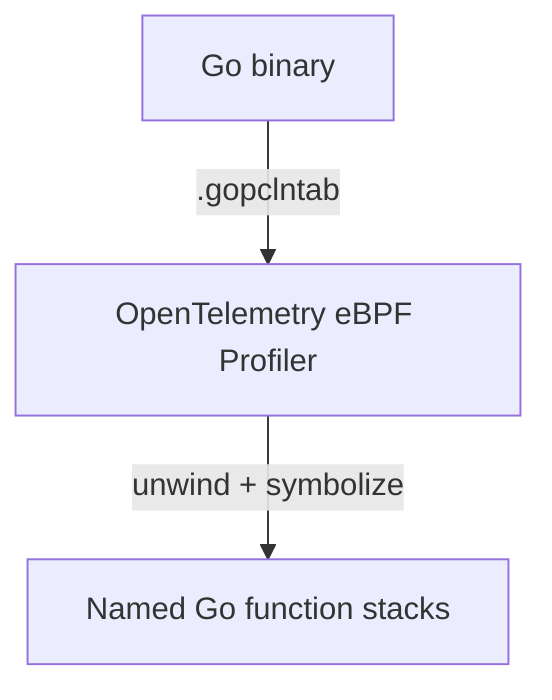

</div>

`.gopclntab` remains in fully static, stripped executables because the Go runtime needs it too.

---

<!-- _class: vcenter -->

## Stripping does not erase `.gopclntab`

> "The information remains present even for fully static and stripped executables."
>
> [OpenTelemetry eBPF Profiler documentation](https://github.com/open-telemetry/opentelemetry-ebpf-profiler/blob/main/doc/gopclntab.md)

---

## Zero-touch profiling still has a deployment cost

| Application | Profiler agent |
| --- | --- |
| No source changes | Linux node access |
| No rebuild | `CAP_BPF` + `CAP_PERFMON` or root |
| No in-process agent | DaemonSet / Collector distribution |
| Stripped binaries supported | CPU profiling is the confirmed core signal |

<br>

The eBPF profiler will add memory profiling soon. But `pprof` still has the edge: more profile types, more granular data, and no kernel privileges.

---

<!-- _class: punchline dark -->
<!-- _paginate: false -->

# Traces and profiles. *Apart.*

---

## Correlation is the missing bridge

Native runtimes can publish request context through thread-local storage.

Go cannot rely on that model: goroutines move between OS threads, and crossing FFI on every event is too costly.

The proposed Go path uses **pprof labels**:

<!-- code-header: none -->

```yaml
threadlocal.schema_version: "go_pprof_labels_v1"
```

<div class="tiny">

[OTEP 4947: Alternative for Go support](https://github.com/open-telemetry/opentelemetry-specification/blob/main/oteps/profiles/4947-thread-ctx.md#alternative-for-go-support)

</div>

---

<!-- _class: punchline dark -->

# Compile time sets context
# eBPF reads *evidence*

### Together, request context reaches profiles

---

<!-- _class: section -->
<!-- _paginate: false -->

###### 06

# When to reach for what

---

## When to reach for what

| Constraint | Prefer |
| --- | --- |
| No rebuild window | OBI or injector |
| Non-Linux target | otelc |
| Mixed-language boundary coverage | OBI |
| Rich Go library semantics | otelc |
| No privileged runtime agent | otelc or injector |
| Whole-node CPU profiles | eBPF Profiler |
| Request-correlated profiles | Compile-time context + profiler |

---

## A practical production combination

<div class="center">

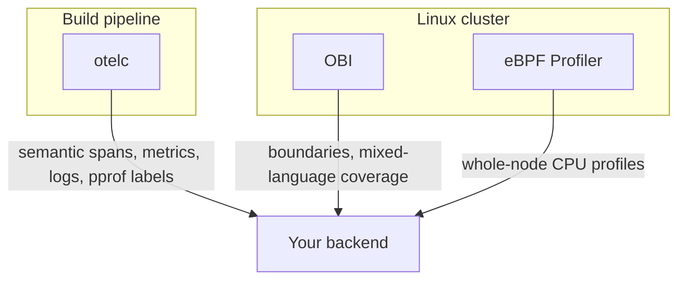

</div>

Start with the constraint you cannot change. Add the other layer when its signal earns the cost.

**20% adoption growth** is evidence that Go users want the build-time path too.

---

<!-- _class: section -->
<!-- _paginate: false -->

###### 07

# What comes next

---

## User Statically-Defined Tracing (USDT)

USDT probes put stable, named hook points in the binary instead of forcing tools to chase function addresses.

<div class="columns">
<div>

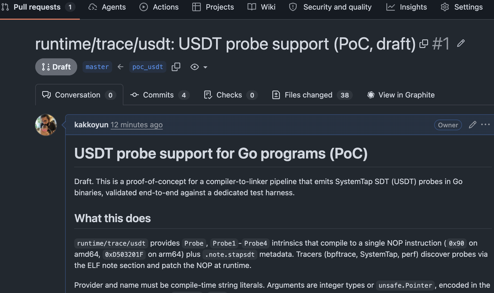

</div>
<div>

```bash
# Proof of concept: github.com/kakkoyun/go/tree/poc_usdt
go tool usdt list ./...

# probe: net/http.(*conn).serve enter
# probe: database/sql.(*DB).QueryContext enter
```

Go ships no built-in USDT probes today. The proof of concept shows what a stable contract could look like.

</div>
</div>

---

<!-- _class: vcenter -->

## The loop, without the redeploy

<br>

Describe the bug in words. The agent places the probe and reads *production evidence*.

No source edit. No restart. No *redeploy*.

<br>

Bits Live Debugger does this today, in preview.

Same move as the opening joke, except now the agent has the *framework*.

---

<!-- _class: vcenter -->

## Takeaways

<br>

Start from the *constraint* you cannot change.

Add a layer only when its *signal* pays for its *operational cost*.

---

<!-- _class: terminal -->

# Take it home

```bash
go install github.com/kakkoyun/zeroins/cmd/...@latest
obi-integration net/http     # offline OBI v0.10.0 catalog
otelc-aspect    net/http     # offline otelc v1.0.1 catalog
npx skills add kakkoyun/zeroins --all
```

<br>

Catalog lookups are offline and read-only. `kubectl-obi` and `kubectl-profiler` are experimental privileged wrappers needing an explicit OTLP endpoint.

For more agent skills for instrumenting Go applications, see [github.com/ollygarden/opentelemetry-agent-skills](https://github.com/ollygarden/opentelemetry-agent-skills).

---

## Get involved in the SIGs

[github.com/open-telemetry/community](https://github.com/open-telemetry/community) has every SIG's calendar, notes, and channels.

- Go Compile-Time Instrumentation (`otelc`)
- eBPF Instrumentation (OBI)
- Injector
- Profiling

---

<!-- _class: dark -->

# Take it with you

<div class="columns">
<div>

### Talk material

[github.com/kakkoyun/gopherconuk-26](https://github.com/kakkoyun/gopherconuk-26)

Both decks · research · [earlier FOSDEM version](https://youtu.be/0TvrSebuDPk)

### zeroins toolkit

[github.com/kakkoyun/zeroins](https://github.com/kakkoyun/zeroins)

`obi-integration` · `otelc-aspect`<br>
`kubectl-obi` · `kubectl-profiler`

</div>
<div class="center">


**Scan for the talk repository**

</div>
</div>

---

<!-- _paginate: false -->
<!-- _class: end gopher-balloon -->

# Questions?

[kakkoyun.me](https://kakkoyun.me) · [github.com/kakkoyun](https://github.com/kakkoyun)

[linkedin.com/in/kakkoyun](https://www.linkedin.com/in/kakkoyun/) · [bsky.app/profile/kakkoyun.me](https://bsky.app/profile/kakkoyun.me) · [x.com/kakkoyun_me](https://x.com/kakkoyun_me)

<span class="small">Talk repo [github.com/kakkoyun/gopherconuk-26](https://github.com/kakkoyun/gopherconuk-26) · Tools [github.com/kakkoyun/zeroins](https://github.com/kakkoyun/zeroins)</span>
