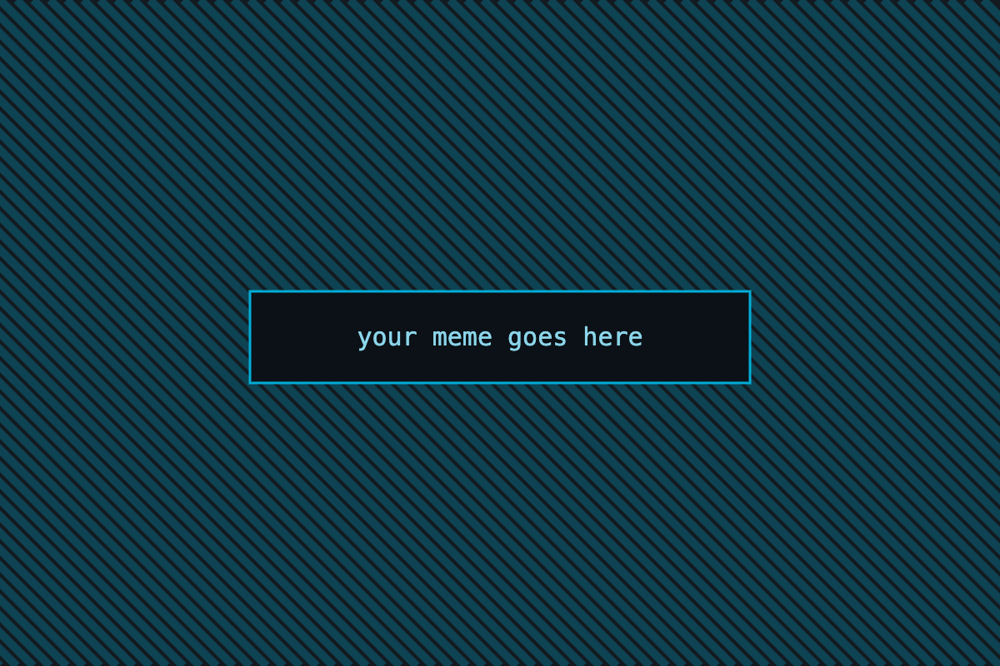
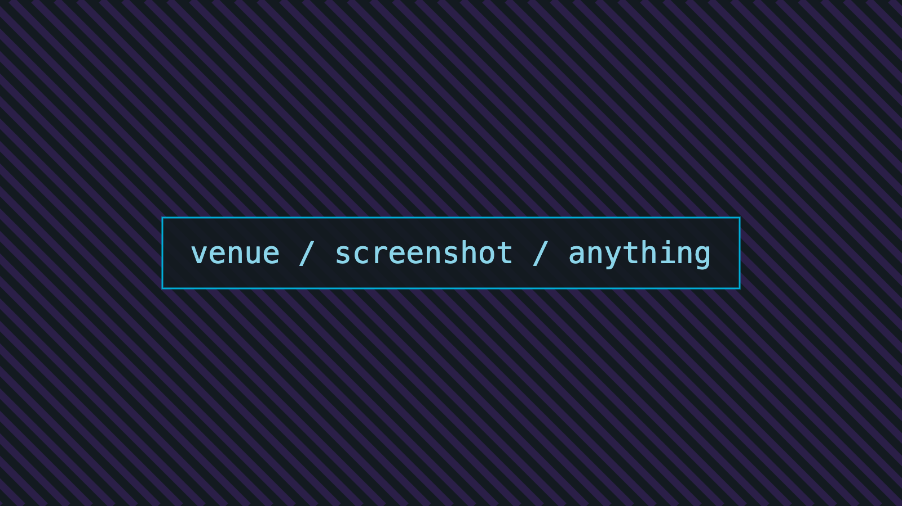
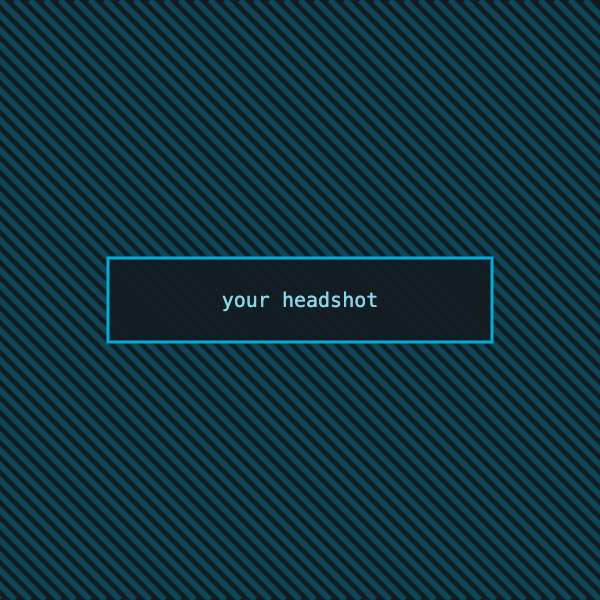

<!-- _class: title gopher-hero -->
<!-- _paginate: false -->

##### GopherCon UK · 12 Aug 2026

# Profiling Go in production

### Speaker Name

Staff Engineer · Datadog

---

<!-- _class: section -->

###### 01

# Runtime internals

Where the scheduler spends its time, and how to see it.

---

# Collect without allocating

###### profiler/collect.go

```go
// Collect runs one CPU profile window.
func (p *Profiler) Collect(ctx context.Context) error {
	buf := p.pool.Get()
	defer p.pool.Put(buf)

	if err := pprof.StartCPUProfile(buf); err != nil {
		return fmt.Errorf("start profile: %w", err)
	}
	defer pprof.StopCPUProfile()
}
```

---

# Disassemble the hot path

###### profiler/collect.go

```asm
TEXT ·Collect(SB), NOSPLIT, $0-8
    MOVD  buf+0(FP), R0
    CALL  runtime·pprofStartCPUProfile(SB)
```

A reading, not source — the header names the file that was disassembled.

---

# Captured output

###### collect.bench

```text
BenchmarkCollect-10   14322   81.4 ns/op   0 B/op
```

The header names the artifact the bytes came from; the `$` marks it as command
output.

---

# A shell command

```bash
go test -bench=Collect -benchmem -count=10
```

The body *is* the command, so no header — just the purple rail and a corner `$`.

---

# Three labels

<span class="chip note">structural aside</span>

<span class="chip measure">a reading</span>

<span class="chip caution">do not ship this</span>

---

<!-- _class: emoji -->

# Four things we tried first

- 🔥 Flamegraphs, read wrong — depth is not cost
- 🧊 Cold paths that still bill you every request
- 📉 Averages, which hid the only number that mattered
- 🤖 Automating the diff instead of the reading

---

<!-- _class: chart -->

# p99 latency, by endpoint

##### milliseconds · 24h window

<div class="bars">
  <div class="row"><span class="label">/checkout</span><span class="track"><span class="fill" style="width:92%"></span></span><span class="value">412</span></div>
  <div class="row"><span class="label">/search</span><span class="track"><span class="fill" style="width:60%"></span></span><span class="value">268</span></div>
  <div class="row"><span class="label">/inventory</span><span class="track"><span class="fill" style="width:43%"></span></span><span class="value">191</span></div>
  <div class="row mark"><span class="label">/checkout*</span><span class="track"><span class="fill" style="width:20%"></span></span><span class="value">88</span></div>
</div>

---

<!-- _class: stat -->

# 79%

of the CPU time was in code **nobody had read** for two years.

---

<!-- _class: compare -->

# One line, measured

###### −79%

> **Before**
> `buf := new(bytes.Buffer)`
> ## 412 <small>ms</small>
> 18 MB / minute

> **After**
> `buf := p.pool.Get()`
> ## 88 <small>ms</small>
> 0.4 MB / minute

---

<!-- _class: terminal -->

# Live demo

```console
$ go tool pprof -http=:6060 cpu.pprof
Fetching profile over HTTP from localhost:6060
Saved profile in ~/pprof/pprof.samples.cpu.001.pb.gz
Serving web UI on http://localhost:6060

$ go test -bench=Collect -benchmem
BenchmarkCollect-10   14322   81.4 ns/op   0 B/op
```

---

<!-- _class: meme -->



when the profiler blames the GC

---

# What the numbers said

| Change | Allocations | p99 | Verdict |
| --- | --- | --- | --- |
| Buffer pool | −99% | −79% | Ship it |
| Tighter sampling | −4% | −2% | Noise |
| GC tuning | 0% | +1% | Revert |

---

<!-- _class: dark -->

# Two columns, any content

<div class="cols">
<div class="card">

### Read the flame

Wide bars are cost, not depth. Compare two windows before you tune anything.

</div>
<div class="card measure">

### Then measure

Every frame is a decision someone made. Find the decision, not the frame.

</div>
</div>

---

> A profile is a hypothesis, not a verdict.

---

<!-- _class: section -->

###### 02

# Shipping it

What survived contact with production.

---

<!-- _class: agenda -->

# Where we're going

1. Runtime internals
2. **Reading a profile without lying to yourself**
3. Shipping it
4. What I'd do differently

---

<!-- _class: photo -->



##### The Brewery, 2025

# Three hundred people, one flamegraph

Nobody in the room agreed on what it meant.

---

<!-- _class: emoji -->

# Reveal these one at a time

* 🔥 First you notice the wide bar
* 🧊 Then you notice it's been there for a year
* 📉 Then you notice nobody owns it
* 🤖 Then you write the tool you should have written first

---

<!-- _class: punchline dark -->

# It was a *for loop*.

---

<!-- _class: speaker -->



# Speaker Name

### Staff Engineer · Datadog

- bluesky **@handle**
- github **@handle**
- slides **example.dev/gcuk**

---

<!-- _class: end gopher-rocket -->
<!-- _paginate: false -->

# Thank you

<div class="qr"></div>

- slides → example.dev/gcuk
- bluesky → @handle
- code → github.com/handle/talk
